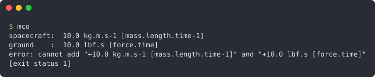

<div align="center">

# FURY
#### Fortran Units (environment) for Reliable phYsical math

[](https://github.com/szaghi/FURY/tags)
[](https://github.com/szaghi/FURY/issues)
[](https://github.com/szaghi/FURY/actions/workflows/ci.yml)
[](https://github.com/szaghi/FURY/actions/workflows/ci.yml)
[](#copyrights)

> Numbers that know their units, in pure Fortran 2018: FURY checks every sum, assignment and conversion of your physical
> quantities, derives the units of products and powers, and stops the program at the first inconsistency, instead of
> letting a wrong number through.



<sub>The bug that lost the Mars Climate Orbiter, written with FURY: the program stops at the sum of newton seconds and
pound-force seconds (<a href="docs/examples/src/mco.f90">source</a>).</sub>

<div>
<table>
<tr>
<td width="50%"><b>📏 Quantities with units</b><br><sub>A magnitude and its unit of measure in one object; the arithmetic operators, powers and comparisons work on quantities as on numbers, and the units follow. <a href="https://szaghi.github.io/FURY/manual/tutorial/01-first-quantity">A first quantity</a></sub></td>
<td width="50%"><b>🛑 Inconsistencies stop the program</b><br><sub>Metres plus seconds, a length assigned to a time, a conversion between unrelated units: FURY prints what is wrong and stops with exit status 1. <a href="https://szaghi.github.io/FURY/manual/tutorial/04-consistency">What FURY refuses</a></sub></td>
</tr>
<tr>
<td width="50%"><b>🧮 Symbolic algebra on units</b><br><sub><code>Pa</code> times <code>m2</code> is <code>kg.m.s-2</code>, <code>m.s-1</code> times <code>s</code> is <code>m</code>: products, quotients and powers of units are derived symbolically, dimensions included. <a href="https://szaghi.github.io/FURY/manual/tutorial/03-unit-algebra">The algebra of units</a></sub></td>
<td width="50%"><b>✍️ Units from a string</b><br><sub><code>'kg [mass].m [length].s-2 [time-2] (N[force]) {newton}'</code>: symbols, synonyms, conversion factors and offsets, dimensions, a main alias and a name, in one readable definition. <a href="https://szaghi.github.io/FURY/guide/grammar">Unit grammar</a></sub></td>
</tr>
<tr>
<td width="50%"><b>🔁 Conversions</b><br><sub>Factors (<code>km = 1000 * m</code>), offsets (<code>degC = 273.15 + K</code>), conversions through a common unit (<code>ft</code> to <code>km</code> through <code>m</code>) or a main alias (<code>lbf</code> to <code>N</code>), and non-linear formulas of your own (dBm to mW). <a href="https://szaghi.github.io/FURY/guide/conversions">Conversions</a></sub></td>
<td width="50%"><b>🌍 The SI system, ready to use</b><br><sub>42 units, 28 decimal and binary prefixes, 15 constants of the 2019 SI and CODATA 2018, queried by name, symbol or synonym, prefixed or not (<code>km</code>, <code>kilometre</code>, <code>KiB</code>); systems of your own. <a href="https://szaghi.github.io/FURY/guide/systems">Units systems</a></sub></td>
</tr>
<tr>
<td width="50%"><b>🎯 Three precisions</b><br><sub>Every type in 32, 64 and 128 bits, with mixed-kind arithmetic; quadruple precision is optional, for compilers and builds without it. <a href="https://szaghi.github.io/FURY/guide/precision">Precision</a></sub></td>
<td width="50%"><b>🔓 Standard Fortran, multi-licensed</b><br><sub>Fortran 2018, tested with gfortran 14 and 16, built with FoBiS or fpm; GPL v3 for FOSS projects, BSD 2-Clause, BSD 3-Clause or MIT for the others. <a href="#copyrights">Copyrights</a></sub></td>
</tr>
</table>
</div>

**[Full documentation](https://szaghi.github.io/FURY/)** · [Tutorial](https://szaghi.github.io/FURY/manual/tutorial/01-first-quantity) · [Cookbook](https://szaghi.github.io/FURY/manual/cookbook) · [API reference](https://szaghi.github.io/FURY/api/)

</div>

## Quick start

Define the units, attach them to numbers, compute: how fast is Bolt?

```fortran
program bolt
use fury
implicit none
type(uom64)   :: metre, second
type(qreal64) :: distance, time, speed

metre  = uom64('m = metre = meter [length] {metre}')
second = uom64('s = sec = second [time] {second}')

distance = 100._R8P * metre
time     = 9.58_R8P * second
speed    = distance / time

print '(A)', 'speed    : '//speed%stringify(format='(F6.3)', with_dimensions=.true.)
endprogram bolt
```

```console
$ bolt
speed    : 10.438 m.s-1 [length.time-1]
```

The unit of the speed and its dimensions are derived by FURY. Add a length to that speed, assign it to a time, convert it
to kilograms, and the program stops with an error that says what is wrong.

New to FURY? The [tutorial](https://szaghi.github.io/FURY/manual/tutorial/01-first-quantity) goes from a first quantity
to a units system of your own in nine short chapters; the [cookbook](https://szaghi.github.io/FURY/manual/cookbook) has
short recipes. Every code sample of the documentation is a compiled, runnable program in
[`docs/examples/src`](docs/examples/src), shown with its real output.

## Install

### FoBiS

**Standalone**: clone, fetch the dependencies, build.

```bash
git clone https://github.com/szaghi/FURY && cd FURY
fobis fetch                            # PENF, StringiFor, BeFoR64, FACE, FLAP
fobis build --mode fury-static-gnu     # lib/libfury.a and lib/mod/
```

**As a project dependency**: declare FURY in your `fobos` and fetch it.

```ini
[dependencies]
deps_dir = src/third_party
FURY     = https://github.com/szaghi/FURY
```

### fpm

```toml
[dependencies]
FURY = { git = "https://github.com/szaghi/FURY" }
```

fpm cannot pass the quadruple precision macro to the dependencies: FURY built by fpm has the 32 and 64 bits types only
(see [Precision](https://szaghi.github.io/FURY/guide/precision)).

A Fortran 2018 compiler is required: tested with gfortran 14 and 16 (see
[Installation](https://szaghi.github.io/FURY/guide/install)).

## Authors

- Stefano Zaghi — [@szaghi](https://github.com/szaghi)

FURY is dedicated to W. Van Snyder. Contributions are welcome — see the
[Contributing](https://szaghi.github.io/FURY/guide/contributing) page.

## Copyrights

This project is distributed under a multi-licensing system:

- **FOSS projects**: [GPL v3](http://www.gnu.org/licenses/gpl-3.0.html)
- **Closed source / commercial**: [BSD 2-Clause](http://opensource.org/licenses/BSD-2-Clause), [BSD 3-Clause](http://opensource.org/licenses/BSD-3-Clause), or [MIT](http://opensource.org/licenses/MIT)

> Anyone interested in using, developing, or contributing to this project is welcome — pick the license that best fits your needs.
