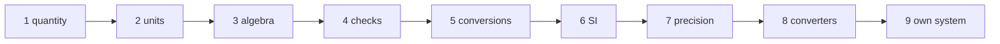

# The tutorial

The tutorial teaches FURY in nine short chapters, from a first quantity to a units system of your own. The
[cookbook](./cookbook) then collects short recipes for everyday tasks, and the [reference](/guide/features) has every
rule of the grammar, every type and every error.

Each chapter is a complete program that you can compile and run; every output shown is the real output of that program.

| Chapter | You learn |
|---|---|
| [1. A first quantity](./tutorial/01-first-quantity) | units from a string, quantities, arithmetic, printing |
| [2. Defining units](./tutorial/02-defining-units) | the grammar: symbols, aliases, dimensions, names, compound units, main aliases |
| [3. The algebra of units](./tutorial/03-unit-algebra) | products, quotients and powers of units; why dimensions matter |
| [4. What FURY refuses](./tutorial/04-consistency) | the consistency checks: sums, assignments, definitions; comparisons |
| [5. Conversions](./tutorial/05-conversions) | factors, offsets, several aliases, conversions through a main alias |
| [6. The SI system](./tutorial/06-si-system) | units, prefixes and constants by name or symbol |
| [7. Precision](./tutorial/07-precision) | 32, 64 and 128 bits quantities, mixed kinds |
| [8. Non-linear conversions](./tutorial/08-converters) | a converter of your own: dBm to mW |
| [9. A units system of yours](./tutorial/09-own-system) | extending `system_abstract` |



## Compiling the examples

With FURY built by FoBiS (see [Installation](/guide/install)), a chapter compiles as:

```bash
gfortran -I lib/mod tutorial_1.f90 lib/libfury.a -o tutorial_1
```

The programs are in [`docs/examples/src`](https://github.com/szaghi/FURY/tree/master/docs/examples/src).

Start with [1. A first quantity](./tutorial/01-first-quantity).
